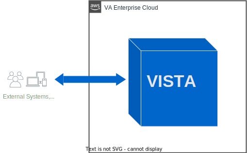
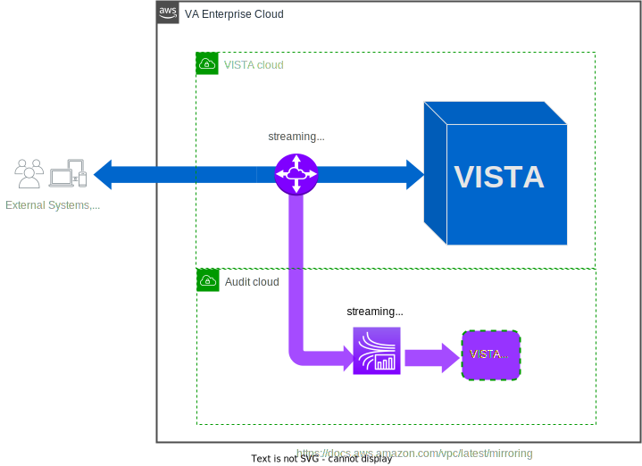

== Vista Architecture
  

The Veterans Health Administration (VHA) Information Sytems Technology and Architecture (VISTA) is the system of record for the clinical, administrative and financial operations of the Veterans Health Administraiton (VHA). VHA operates the largest national healthcare system in the United States with a staff of 270,000 at 1298 medical facilities.  In FY22, VHA provided over 115 million veteran care encounters using VISTA.

VISTA's database contains the lifelong health record of over 20 million veterans - a total of over 400 million veteran-years of data - and incorporates over 35 years of veteran and VA-specific care and institutional knowledge within its applications.  This integration of lifelong health data with all applications allows VISTA to perform over 200 million healthcare transactions each day with millisecond latency with 99.999992% uptime, and enables VHA to fullfull its mission of providing comprehensive lifelong healthcare services to veterans nationwide.

==  Vista Cloud Migration
VA is in the process of migrating all VistA systems to the VA Enterprise Cloud (VAEC), a federally certified commercial cloud managed by Amazon Web Services (AWS).
There are currently 20 VistA sytems in operation in VAEC. In FY23 an additional 52 Vista sytems will be migrated. All Vista systems will be fully migrated and in operation in the VAEC by late 2024. 

Migrating the VistA systems to the cloud without modification ('lift-and-shift') does not change or add any new services or features to users of Vista. However, cloud migration is a necessary first step in establishing a new modern, scalable cloud infrastructure that Vista can take advantage of in its evolution in the cloud.

==  Vista Adaptive Maintenance (VAM)
Vista is being adapted to take advantage of its new environment and services in the VA Enterprise Cloud to provide improved access, security, and performance, and to provide improve user experience and efficiency. 

The first phase of adaptive maintenance is to profile Vista's interface and traffic flows between Vista and all of its users, clients, and applications. The profiling  of Vista traffic flows will enable an empirical data-driven approach to improvements of VistA based on actual usage of Vista.  This will allow VA to focus its resources on high-value improvements, and to potentially retire those components of Vista that are not being used. 

VAM has been developed, tested, and authorized for operation in the VA Enterprise Cloud.  For details see: https://docs.aws.amazon.com/vpc/latest/mirroring and  https://aws.amazon.com/streaming-data/real-time)

